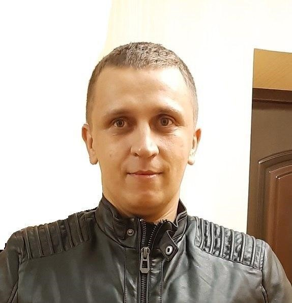

# 1. Bondar Sergey - Front End Developer



## **2. Contact information:**

------------

* **Discrord:** @pe000304
* **e-mail:** [bsg887@gmail.com](mailto:bsg887@gmail.com)
* **telegram:** @pe000304
* **Github:** [https://github.com/pe000304](https://github.com/pe000304 "https://github.com/pe000304")
  
## **3. Goals:**

------------

* Front End Developer
* Work Expirience: [Enter Engineering](https://www.ent-en.com/ru/ "Enter Engineering") - Chief designer of instrumetion.

## **4. Proffesional skills:**

------------

**Hard skills:**

* Html5
* CSS3
* JavaScript
* GIT
* Adobe Photoshop
* Inventor 3D
* Figma

**Soft skills:**

* Problem solving
* Listening
* Participation
* TeamPlayer

## **5. Examples code:**

------------

   ````javascript
   function multiply(a, b){
  return a * b
}
   ````

## **6. Examples my projects:**

------------

   1. [buildhouse.pl](http://buildhouse.pl "buildhouse.pl")
   2. [labdig.ru](http://labdig.ru/ "labdig.ru")

## **7. Education:**

------------

* [Brest state technical university (BSTU)](https://www.bstu.by/ "bstu.by")
* [Sololearn (Html5)](https://www.sololearn.com/Certificate/1014-4338102/jpg "Sololearn (Html5)")
* [W3schools](https://my-learning.w3schools.com/ "W3schools")

## **8. Languages:**

------------

* **English** - Pre-Intermidiate (A2)
* **Russian** - Native
